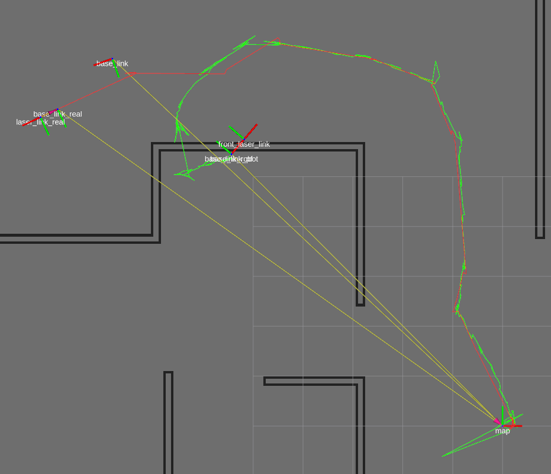

## Overview

Easily compare / visualize a robots path in simulation with Gazebo and Rviz (ROS).

## Features:

* Compare two paths and visualize them in rviz by running `roslaunch ../../path_compare_viz path_visualization.launch`
  (For instance in order the compare estimated and ground truth paths in simulation
* Record and visualize a single taken path by the robot by running `roslaunch ../../path_compare_viz single_path_viz.launch`

## Usage

Download or clone the repo.

Both nodes have their own `config.yaml` file.
Inside you can set to which topic a node should subscribe and publish to.
Path visualization currently works from following source types:
* `nav_msgs/Odometry`
* `geometry_msgs/PoseStamped`
* `geometry_msgs/Pose`

A path is published on `nav_msgs/Path` topic.

Additionally angle and distance thresholds can be specified. Internally these are used to determine if a new callback pose is far away enough to publish again.

### Example

Real robot-path (Red)

Estimated path (Green)

*Note: This example was taking testing out my monte-carlo localisation implementation*
